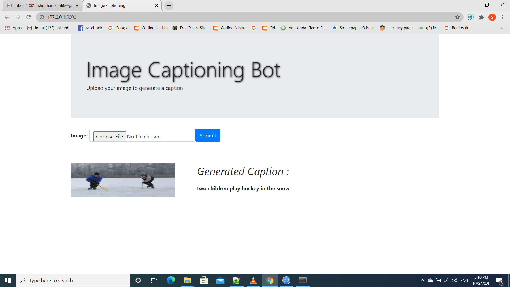
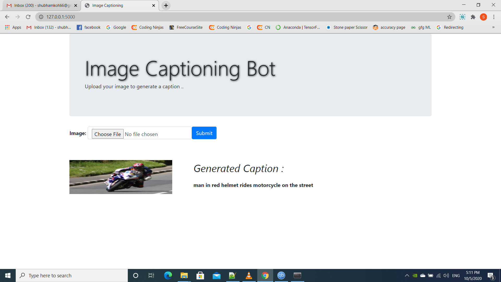

# Image-CaptionBot
*  Deep Learning Model which can predict the Caption of Image.
*  Steps :
      1. Photo and Caption Dataset
      2. Prepare Photo Data
      3. Prepare Text Data
      4. Develop Deep Learning Model
      5. Train With Progressive Loading (NEW)       
      6. Evaluate Model
      7. Generate New Captions

*  Keras (2.2 or higher) installed with either the TensorFlow or Theano backend,scikit-learn, Pandas, NumPy, and Matplotlib.
*  Deployment using Flask framework.

